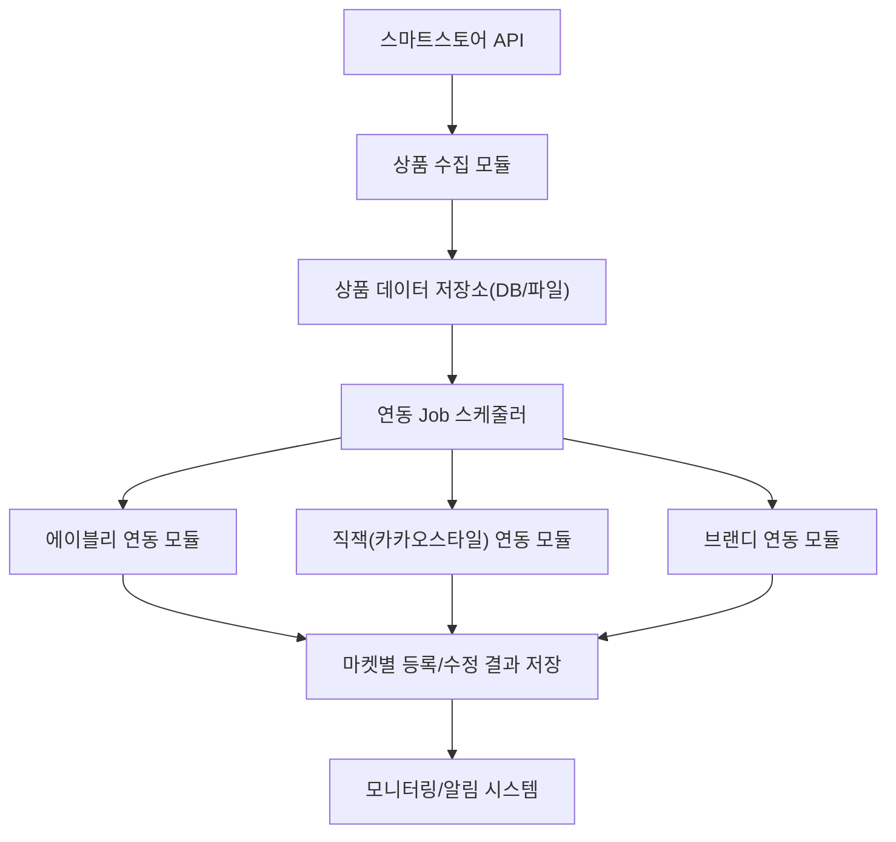

# 네이버 스마트스토어 상품 연동 자동화 시스템 아키텍처

## 1. 전체 시스템 아키텍처 개요

---

## 2. 주요 구성 요소 설명

1. **스마트스토어 API**
   - 네이버 스마트스토어에서 상품 정보를 조회하는 공식 API

2. **상품 수집 모듈**
   - 스마트스토어 API를 통해 상품 목록 및 상세 정보를 주기적으로 수집
   - 신규 상품, 수정 상품을 필터링

3. **상품 데이터 저장소**
   - 수집된 상품 정보를 저장 (DB 또는 파일 기반)
   - 연동 대상 상품 관리

4. **연동 Job 스케줄러**
   - 주기적으로 실행되는 Job(예: cron, APScheduler)
   - 신규/수정 상품을 각 마켓 연동 모듈에 전달

5. **마켓별 연동 모듈**
   - 에이블리, 직잭(카카오스타일), 브랜디 등 각 마켓에 맞는 연동 방식 구현
   - 공식 API가 없는 경우 RPA/크롤링/비공식 API 활용
   - 직잭은 카카오스타일 오픈 API 사용

6. **마켓별 등록/수정 결과 저장**
   - 연동 성공/실패 결과를 저장 및 관리

7. **모니터링/알림 시스템**
   - 연동 실패, 예외 발생 시 슬랙/이메일 등으로 알림

---

## 3. 확장성 고려

- 신규 마켓(토스, 쿠팡, 지마켓 등) 연동 시, 마켓별 연동 모듈만 추가하면 전체 구조는 동일하게 유지
- 각 마켓 연동 모듈은 공통 인터페이스를 따르도록 설계 

## 추가고려사항
1. DB 스키마 명세 및 상태 흐름 정의
products, sync_status, sync_log 테이블 정의
상품 상태(신규, 수정, 삭제)와 연동 상태(pending, success, fail 등) 흐름도
플랫폼별 상태 필드 (ably_status, zigzag_status 등) 분리 여부

2. 실패 재처리 정책
연동 실패 시 다음 Job 때 자동 재시도? 수동 처리 대상? 실패 횟수 제한?
예외 상황 예: 세션 만료, 이미지 업로드 실패, 네트워크 오류 등

3. 로그/모니터링 시스템 구조
로그 수집 위치 (파일/DB/외부 로깅 시스템)
연동 성공/실패 통계 대시보드 구성 여부
연동 로그 조회용 CLI 또는 웹 뷰 제공 여부

4. 테스트 및 QA 전략
스마트스토어와 마켓 간 연동 로직 테스트는 실제 상품 등록을 수반하므로,
테스트 상품 셋 분리
dry-run 모드 제공
자동화 테스트와 수동 테스트 병행 전략